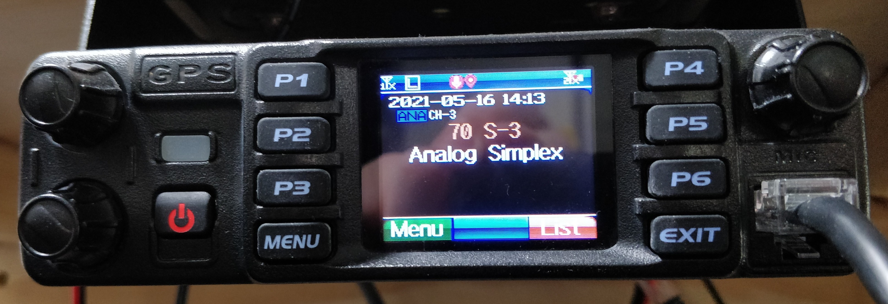

# py-d578uv

This is a python library designed to interface to an AnyTone™ AT-D578UV radio's Microphone port serial connection.

## Features
- [X] Control the radio's PTT line
- [ ] Send keypad button presses
- [ ] Continuously monitor the radio's state
- [ ] Perform callbacks on RX sense

## Copyright and License
Copyright © 2021 Michael Englehorn 

This program is free software: you can redistribute it and/or modify 
it under the terms of the GNU General Public License as published by 
the Free Software Foundation, either version 3 of the License, or 
(at your option) any later version. 

This program is distributed in the hope that it will be useful, 
but WITHOUT ANY WARRANTY; without even the implied warranty of 
MERCHANTABILITY or FITNESS FOR A PARTICULAR PURPOSE.  See the 
GNU General Public License for more details. 

You should have received a copy of the GNU General Public License 
along with this program.  If not, see <https://www.gnu.org/licenses/>. 

## Examples
### Control PTT
```
import d578uv
radio = d578uv.d578uv('/dev/ttyUSB0')

# Transmit for 5 seconds
radio.Tx(5)

# Transmit until told to stop transmitting
radio.Tx()

# Stop transmitting, enter receive mode
radio.Rx()
```

## Pictures
### AT-578UV


### Wiring
In order to determine which UART commands needed to be sent to the radio, and how the radio responds, I used a Bus Pirate by [Dangerous Prototypes](https://www.seeedstudio.com/Bus-Pirate-v3-6-universal-serial-interface-p-609.html)  
I also built a small Cat5 cable breakout that split the cable between the radio and microphone, and allowed me to probe it while it was in operation.


## Decoded Communications
### Microphone to Radio
Notes
- A single 0x06 packet is sent approximately once per second by the microphone to the radio as a type of keepalive

| Description      | Byte 0 |  PTT | Pressed | Long Press | Button Address | Byte 5 | Byte 6 | Number of Bytes |
|------------------+--------+------+---------+------------+----------------+--------+--------+-----------------|
| PTT Pressed      |   0x41 | 0x01 |    0x00 |       0x00 |           0x00 |   0x00 |   0x00 |               7 |
| PTT Released     |   0x41 | 0x00 |    0x00 |       0x00 |           0x00 |   0x00 |   0x00 |               7 |
| A = Pressed      |   0x41 | 0x00 |    0x01 |       0x00 |           0x1a |   0x00 |   0x00 |               7 |
| A = Held Long    |   0x41 | 0x00 |    0x01 |       0x01 |           0x1a |   0x00 |   0x00 |               7 |
| A = Released     |   0x41 | 0x00 |    0x00 |       0x01 |           0x1a |   0x00 |   0x00 |               7 |
| B = Pressed      |   0x41 | 0x00 |    0x01 |       0x00 |           0x1b |   0x00 |   0x00 |               7 |
| B = Held Long    |   0x41 | 0x00 |    0x01 |       0x01 |           0x1b |   0x00 |   0x00 |               7 |
| B = Released     |   0x41 | 0x00 |    0x00 |       0x01 |           0x1b |   0x00 |   0x00 |               7 |
| C = Pressed      |   0x41 | 0x00 |    0x01 |       0x00 |           0x1c |   0x00 |   0x00 |               7 |
| C = Held Long    |   0x41 | 0x00 |    0x01 |       0x01 |           0x1c |   0x00 |   0x00 |               7 |
| C = Released     |   0x41 | 0x00 |    0x00 |       0x01 |           0x1c |   0x00 |   0x00 |               7 |
| D = Pressed      |   0x41 | 0x00 |    0x01 |       0x00 |           0x1d |   0x00 |   0x00 |               7 |
| D = Held Long    |   0x41 | 0x00 |    0x01 |       0x01 |           0x1d |   0x00 |   0x00 |               7 |
| D = Released     |   0x41 | 0x00 |    0x00 |       0x01 |           0x1d |   0x00 |   0x00 |               7 |
| D = Short 1      |   0x41 | 0x00 |    0x01 |       0x00 |           0x1d |   0x00 |   0x00 |               7 |
| D = Short 2      |   0x41 | 0x00 |    0x00 |       0x00 |           0x1d |   0x00 |   0x00 |               7 |
| 1 = Pressed      |   0x41 | 0x00 |    0x01 |       0x00 |           0x02 |   0x00 |   0x00 |               7 |
| 2 = Pressed      |   0x41 | 0x00 |    0x01 |       0x00 |           0x03 |   0x00 |   0x00 |               7 |
| 3 = Pressed      |   0x41 | 0x00 |    0x01 |       0x00 |           0x04 |   0x00 |   0x00 |               7 |
| 4 = Pressed      |   0x41 | 0x00 |    0x01 |       0x00 |           0x05 |   0x00 |   0x00 |               7 |
| 5 = Pressed      |   0x41 | 0x00 |    0x01 |       0x00 |           0x06 |   0x00 |   0x00 |               7 |
| 6 = Pressed      |   0x41 | 0x00 |    0x01 |       0x00 |           0x07 |   0x00 |   0x00 |               7 |
| 7 = Pressed      |   0x41 | 0x00 |    0x01 |       0x00 |           0x08 |   0x00 |   0x00 |               7 |
| 8 = Pressed      |   0x41 | 0x00 |    0x01 |       0x00 |           0x09 |   0x00 |   0x00 |               7 |
| 9 = Pressed      |   0x41 | 0x00 |    0x01 |       0x00 |           0x0a |   0x00 |   0x00 |               7 |
| 0 = Pressed      |   0x41 | 0x00 |    0x01 |       0x00 |           0x01 |   0x00 |   0x00 |               7 |
| * = Pressed      |   0x41 | 0x00 |    0x01 |       0x00 |           0x0b |   0x00 |   0x00 |               7 |
| # = Pressed      |   0x41 | 0x00 |    0x01 |       0x00 |           0x0c |   0x00 |   0x00 |               7 |
| SubPTT = Pressed |   0x41 | 0x00 |    0x01 |       0x00 |           0x0d |   0x00 |   0x00 |               7 |
| Down = Pressed   |   0x41 | 0x00 |    0x01 |       0x00 |           0x11 |   0x00 |   0x00 |               7 |
| Up = Pressed     |   0x41 | 0x00 |    0x01 |       0x00 |           0x10 |   0x00 |   0x00 |               7 |

### Button Address Table
This is for clarity

| Button   | Address |
|----------+---------|
| `PTT`    |    0x00 |
| `0`      |    0x01 |
| `1`      |    0x02 |
| `2`      |    0x03 |
| `3`      |    0x04 |
| `4`      |    0x05 |
| `5`      |    0x06 |
| `6`      |    0x07 |
| `7`      |    0x08 |
| `8`      |    0x09 |
| `9`      |    0x0a |
| `*`      |    0x0b |
| `#`      |    0x0c |
| `SubPTT` |    0x0d |
| `Up`     |    0x10 |
| `Down`   |    0x11 |
| `A`      |    0x1a |
| `B`      |    0x1b |
| `C`      |    0x1c |
| `D`      |    0x1d |

### Radio to Microphone
| Description | Byte 0 | Byte 1 | Byte 2 | Byte 3 | Byte 4 | Byte 5 | Byte 6 | Byte 7 | Byte 8 | Byte 9 | Byte 10 | Byte 11 | Byte 12 | Byte 13 | Byte 14 | Byte 15 |
|-------------+--------+--------+--------+--------+--------+--------+--------+--------+--------+--------+---------+---------+---------+---------+---------+---------|
| RX Start, A |   0x53 |   0x01 |   0x01 |   0x00 |   0x00 |   0x00 |   0x00 |   0x00 |   0x00 |   0x10 |    0x00 |    0x00 |    0x00 |    0x00 |    0x00 |    0x06 |
| RX Stop, A  |   0x53 |   0x00 |   0x00 |   0x00 |   0x00 |   0x00 |   0x00 |   0x00 |   0x00 |   0x10 |    0x00 |    0x00 |    0x00 |    0x00 |    0x00 |    0x06 |
| A to B      |   0x53 |   0x00 |   0x00 |   0x00 |   0x00 |   0x00 |   0x00 |   0x01 |   0x00 |   0x10 |    0x00 |    0x00 |    0x00 |    0x00 |    0x00 |    0x06 |
| B to A      |   0x53 |   0x00 |   0x00 |   0x00 |   0x00 |   0x00 |   0x00 |   0x00 |   0x00 |   0x10 |    0x00 |    0x00 |    0x00 |    0x00 |    0x00 |    0x06 |
| CMD Ack     |   0xaa |        |        |        |        |        |        |        |        |        |         |         |         |         |         |         |
| TX Start, A |   0x53 |   0x00 |   0x00 |   0x01 |   0x00 |   0x00 |   0x00 |   0x00 |   0x00 |   0x10 |    0x00 |    0x00 |    0x00 |    0x00 |    0x00 |    0x06 |
| TX Start, B |   0x53 |   0x00 |   0x00 |   0x00 |   0x00 |   0x00 |   0x01 |   0x01 |   0x00 |   0x10 |    0x00 |    0x00 |    0x00 |    0x00 |    0x00 |    0x06 |
| TX End, A   |   0x53 |   0x00 |   0x00 |   0x00 |   0x00 |   0x00 |   0x00 |   0x00 |   0x00 |   0x10 |    0x00 |    0x00 |    0x00 |    0x00 |    0x00 |    0x06 |
| TX End, B   |   0x53 |   0x00 |   0x00 |   0x00 |   0x00 |   0x00 |   0x00 |   0x01 |   0x00 |   0x10 |    0x00 |    0x00 |    0x00 |    0x00 |    0x00 |    0x06 |

